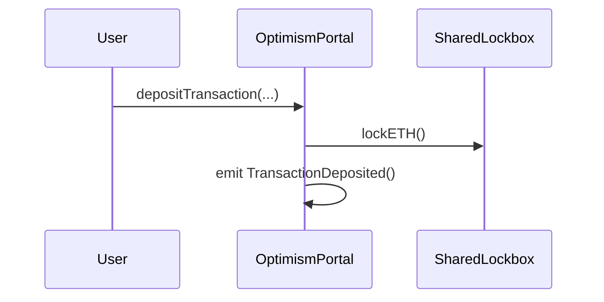
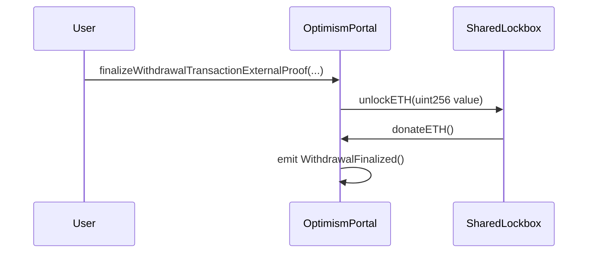

# OptimismPortal

<!-- START doctoc generated TOC please keep comment here to allow auto update -->
<!-- DON'T EDIT THIS SECTION, INSTEAD RE-RUN doctoc TO UPDATE -->
**Table of Contents**

- [Overview](#overview)
  - [Integrating `SharedLockbox`](#integrating-sharedlockbox)
  - [Invariants](#invariants)

<!-- END doctoc generated TOC please keep comment here to allow auto update -->

## Overview

The `OptimismPortal` contract is upgraded to integrate the `SharedLockbox` and start using the shared ETH liquidity.
This liquidity consists of every ETH balance migrated from each `OptimismPortal`
when joining the op-governed dependency set.

### Integrating `SharedLockbox`

The integration with the `SharedLockbox` locking ETH when executing deposit transactions and unlocking ETH
when finalizing withdrawal transactions, without altering other aspects of the current `OptimismPortal` implementation.

To implement this solution, the following changes are needed:

**`depositTransaction`**

Calls `lockETH` on the `SharedLockbox` with the `msg.value`.

- The function MUST call `lockETH` with `msg.value` on the `SharedLockbox` if:
  - The token is `ETHER`.
  - `msg.value` is greater than zero.
  - `OptimismPortal` address is authorized to interact with the `SharedLockbox`.

**`finalizeWithdrawalTransactionExternalProof`**

Calls `unlockETH` on the `SharedLockbox` with the `tx.value`.

- The function MUST call `unlockETH` on the `SharedLockbox` if:
  - The token is `ETHER`.
  - `tx.value` is greater than zero.
  - `OptimismPortal` address is authorized to interact with the `SharedLockbox`.
- The ETH is received by the `OptimismPortal` and then sent with the withdrawal transaction

### Invariants

- It MUST lock the ETH amount on the `SharedLockbox` when on a deposit transaction with value greater than zero

- Only MUST lock ETH if the `OptimismPortal` is authorized to interact with the `SharedLockbox`.

- It MUST unlock the ETH amount being withdrawn from the `SharedLockbox` if it is greater than zero

- Only MUST unlock ETH if the `OptimismPortal` is authorized to interact with the `SharedLockbox`.

- It MUST NOT hold any ETH balance from any deposit transaction
  if the `OptimismPortal` is authorized to interact with the `SharedLockbox`.
