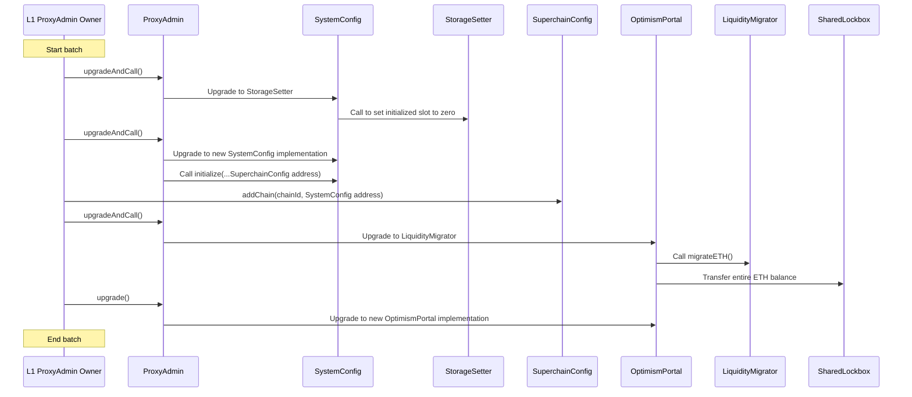

# Shared Lockbox - Upgrade and migration process

<!-- START doctoc generated TOC please keep comment here to allow auto update -->
<!-- DON'T EDIT THIS SECTION, INSTEAD RE-RUN doctoc TO UPDATE -->
**Table of Contents**

- [Overview](#overview)
- [Batch transaction process](#batch-transaction-process)
  - [Diagram](#diagram)
- [Future Considerations / Additional Notes](#future-considerations--additional-notes)

<!-- END doctoc generated TOC please keep comment here to allow auto update -->

## Overview

Based on the decision that a chain joining the dependency set is an irreversible process,
the on-chain chains list is simplified by assuming that joining the Shared Lockbox is
equivalent to joining the op-governed dependency set.

The migration process consists of four main points:

- `OptimismPortal` code upgrade (includes the `SharedLockbox` integration)
- Move ETH liquidity from `OptimismPortal` to `SharedLockbox`
- Set `SuperchainConfig` as dependency manager on `SystemConfig`
- Add the chain to the op-governed dependency set

The migration process needs some prerequisites:

- `SharedLockbox` deployed
- `SuperchainConfig` upgraded to manage the dependency set

**`OptimismPortal` code upgrade**

The `OptimismPortal` will start locking and unlocking ETH through the `SharedLockbox`.
It will continue to handle deposits and withdrawals but won't directly hold the ETH liquidity.
To set this up, the upgrade function will be called via `ProxyAdmin` to implement the new code,
which includes the necessary `SharedLockbox` integration.
The `SharedLockbox` address will be set during the `initialize` function. After this step,
the portal will not be able to process deposits and withdrawals until the chain is registered in `SuperchainConfig`.

**Migrate ETH liquidity from `OptimismPortal` to `SharedLockbox`**

The ETH will be transferred from the `OptimismPortal` to the `SharedLockbox` using an intermediate contract.
This contract functions similarly to the `StorageSetter`, being updated prior to the real implementation.
Its sole purpose is to transfer the ETH balance.
This approach eliminates the need for additional code to move the liquidity to the lockbox later.

**Set `SuperchainConfig` as dependency manager on `SystemConfig`**

The `SystemConfig` manages the dependency updates from L1 to L2 by making a deposit through the portal.
It uses access control, allowing only a designated `dependencyManager` to call it.
The `SuperchainConfig` must be set as the `dependencyManager` since it will be the contract
responsible for handling the op-governed dependency set. This step is crucial before adding a
chain to the dependency set, as it is necessary for keeping the dependency set synchronized
between L1 and L2.

There are two alternatives to accomplish this:

- Upgrade the code to `SystemConfigInterop` and call `initialize` with the dependency manager address
- Add a setter function for the dependency manager

**Add the chain to the op-governed dependency set**

The `SuperchainConfig` contract will be responsible for storing and managing the dependency set.
Its `addChain` function will add a chain to the dependency set and call the `SystemConfig` of each chain
to keep them in sync.
It will also whitelist the corresponding `OptimismPortal`, enabling it to lock and unlock ETH from the `SharedLockbox`.
Once this process is complete, the system will be ready to process deposits and withdrawals.

## Batch transaction process

The most efficient approach is to handle the entire migration process in a single batched transaction.
This transaction will consist of:

1. Call `upgradeAndCall` in the `ProxyAdmin` for the `SystemConfig`
   - Updating provisionally to the `StorageSetter` to zero out the initialized slot.
2. Call `upgradeAndCall` in the `ProxyAdmin` for the `SystemConfig`
   - Calling `initialize` with the `SuperchainConfig` address as the dependency manager
3. Call `addChain` in the `SuperchainConfig`
   - Sending chain ID + system config address
4. Call `upgradeAndCall` in the `ProxyAdmin` for the `OptimismPortal`
   - Update provisionally to the `LiquidityMigrator` to transfer the whole ETH balance to the `SharedLockbox` in this call.
5. Call `upgrade` in the `ProxyAdmin` for the `OptimismPortal`
   - The `SharedLockbox` address is set as immutable in the new implementation

The L1 ProxyAdmin owner will execute this transaction. As the entity responsible for updating contracts,
it has the authority to perform the first two steps.
For the third step, the L1PAO has to be set as authorized for adding a chain to the op-governed dependency set
on the `SuperchainConfig` when initializing.
This process can be set as a [superchain-ops](https://github.com/ethereum-optimism/superchain-ops) task.

### Diagram

## Future Considerations / Additional Notes

- Before calling `addChain`, it MUST be ensured that the `chainId` and `systemConfig` match
