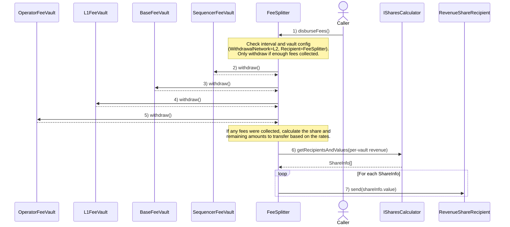

# Predeploys

<!-- START doctoc generated TOC please keep comment here to allow auto update -->
<!-- DON'T EDIT THIS SECTION, INSTEAD RE-RUN doctoc TO UPDATE -->

- [Overview](#overview)
  - [Disburse Fees Flow](#disburse-fees-flow)
- [FeeVault](#feevault)
  - [Functions](#functions)
    - [`setMinWithdrawalAmount`](#setminwithdrawalamount)
    - [`setRecipient`](#setrecipient)
    - [`setWithdrawalNetwork`](#setwithdrawalnetwork)
    - [`recipient`](#recipient)
    - [`minWithdrawalAmount`](#minwithdrawalamount)
    - [`withdrawalNetwork`](#withdrawalnetwork)
  - [Events](#events)
    - [`MinWithdrawalAmountUpdated`](#minwithdrawalamountupdated)
    - [`RecipientUpdated`](#recipientupdated)
    - [`WithdrawalNetworkUpdated`](#withdrawalnetworkupdated)
  - [Invariants](#invariants)
- [Fee Vaults (SequencerFeeVault, L1FeeVault, BaseFeeVault, OperatorFeeVault)](#fee-vaults-sequencerfeevault-l1feevault-basefeevault-operatorfeevault)
- [FeeSplitter](#feesplitter)
  - [Constants](#constants)
  - [Functions](#functions-1)
    - [`initialize`](#initialize)
    - [`disburseFees`](#disbursefees)
    - [`receive`](#receive)
    - [`setRevenueShareRecipient`](#setrevenuesharerecipient)
    - [`setRevenueRemainderRecipient`](#setrevenueremainderrecipient)
    - [`setFeeDisbursementInterval`](#setfeedisbursementinterval)
  - [Events](#events-1)
    - [`FeesDisbursed`](#feesdisbursed)
    - [`NoFeesCollected`](#nofeescollected)
    - [`FeesReceived`](#feesreceived)
    - [`Initialized`](#initialized)
    - [`RevenueShareRecipientUpdated`](#revenuesharerecipientupdated)
    - [`RevenueRemainderRecipientUpdated`](#revenueremainderrecipientupdated)
    - [`FeeDisbursementIntervalUpdated`](#feedisbursementintervalupdated)
- [Security Considerations](#security-considerations)
- [Open Questions](#open-questions)

<!-- END doctoc generated TOC please keep comment here to allow auto update -->

## Overview

| Name        | Address                                    | Introduced | Deprecated | Proxied |
| ----------- | ------------------------------------------ | ---------- | ---------- | ------- |
| FeeSplitter | 0x4200000000000000000000000000000000000029 | Jovian     | No         | Yes     |

The `FeeSplitter` predeploy manages the distribution of all L2 fees. Fee vault contracts (`OperatorFeeVault`,
`BaseFeeVault`, `L1FeeVault`, and `SequencerFeeVault`) update their configuration via setter functions for
minimum withdrawal amounts, withdrawal networks, and recipients without requiring new deployments.

Using the `FeeSplitter` requires vaults to use `WithdrawalNetwork.L2` and set the `FeeSplitter` as their
fee recipient. Chains MAY opt in at any time.

### Disburse Fees Flow



## FeeVault

Legacy immutables are preserved for network-specific config, and storage-based overrides are enabled via getters.
Each getter returns the storage value if set; otherwise, it falls back to the immutable. Setters write the
storage value to opt-in to overrides. There will be a flag to track whether the storage variable was set or not.

### Functions

#### `setMinWithdrawalAmount`

Updates the minimum amount of funds the vault contract must hold before they can be withdrawn.

```solidity
function setMinWithdrawalAmount(uint256 _newMinWithdrawalAmount) external
```

- MUST only be callable by `ProxyAdmin.owner()`
- MUST emit the `MinWithdrawalAmountUpdated` event

#### `setRecipient`

Updates the recipient of sequencer fees when they are withdrawn from the vault.

```solidity
function setRecipient(address _newRecipient) external
```

- MUST only be callable by `ProxyAdmin.owner()`
- MUST emit the `RecipientUpdated` event

#### `setWithdrawalNetwork`

Updates the network to which the vault collected fees will be withdrawn.
This can be either `WithdrawalNetwork.L1` to withdraw them to an address on L1 by using the `L2ToL1MessagePasser`
predeploy, or `WithdrawalNetwork.L2` to withdraw them to an address on the same chain.

```solidity
function setWithdrawalNetwork(WithdrawalNetwork _newWithdrawalNetwork) external
```

- MUST only be callable by `ProxyAdmin.owner()`
- MUST emit the `WithdrawalNetworkUpdated` event

#### `recipient`

Returns the current recipient address, preferring the storage override if set; otherwise falls back to the
legacy immutable value.

```solidity
function recipient() external view returns (address)
```

- MUST check the flag to see if the storage var was set or not.
- MUST return the storage-configured recipient if a storage override has been set via `setRecipient`.
- MUST otherwise return the legacy immutable recipient value.

#### `minWithdrawalAmount`

Returns the current minimum withdrawal amount, preferring the storage override if set; otherwise falls back to
the legacy immutable value.

```solidity
function minWithdrawalAmount() external view returns (uint256)
```

- MUST check the flag to see if the storage var was set or not.
- MUST return the storage-configured minimum if a storage override has been set via `setMinWithdrawalAmount`.
- MUST otherwise return the legacy immutable minimum withdrawal amount.

#### `withdrawalNetwork`

Returns the current withdrawal network, preferring the storage override if set; otherwise falls back to the
legacy immutable value.

```solidity
function withdrawalNetwork() external view returns (WithdrawalNetwork)
```

- MUST check the flag to see if the storage var was set or not.
- MUST return the storage-configured network if a storage override has been set via `setWithdrawalNetwork`.
- MUST otherwise return the legacy immutable withdrawal network.

### Events

#### `MinWithdrawalAmountUpdated`

Emitted when the minimum withdrawal amount for the vault is updated.

```solidity
event MinWithdrawalAmountUpdated(uint256 oldWithdrawalAmount, uint256 newWithdrawalAmount)
```

#### `RecipientUpdated`

Emitted when the fee recipient for this vault is updated.

```solidity
event RecipientUpdated(address oldRecipient, address newRecipient)
```

#### `WithdrawalNetworkUpdated`

Emitted when the withdrawal network for this vault is updated.

```solidity
event WithdrawalNetworkUpdated(WithdrawalNetwork oldWithdrawalNetwork, WithdrawalNetwork newWithdrawalNetwork)
```

### Invariants

- Only `ProxyAdmin.owner()` is allowed to call the setter functions.
- If using the `FeeSplitter`, the withdrawal network MUST be set to `WithdrawalNetwork.L2` and the recipient
  MUST be set to the `FeeSplitter` predeploy address.
- The balance of the vault MUST be preserved between implementation upgrades.

## Fee Vaults (SequencerFeeVault, L1FeeVault, BaseFeeVault, OperatorFeeVault)

These contracts will inherit the changes made to the `FeeVault` contract, meaning that they will have storage
variables and setters instead of constants for the configuration values, and they will be initializable.

Their configuration includes the withdrawal network and the recipient to which the fees will be sent:

- **WithdrawalNetwork.L1**: Funds are withdrawn to an L1 address (default behavior)
- **WithdrawalNetwork.L2**: Funds are withdrawn to an L2 address

For those chains that choose to use the `FeeSplitter` predeploy, `WithdrawalNetwork.L2` as the withdrawal
network, and the `FeeSplitter` as the recipient MUST be set using the setter functions.

## FeeSplitter

This contract splits the ETH it receives and sends the correct amounts to two designated addresses.
It integrates with the fee vault system by configuring each Fee Vault to use `WithdrawalNetwork.L2` and
setting this predeploy as the
recipient in EVERY fee vault.

The contract manages two recipients:

- Revenue share recipient
- Remainder recipient

And it has two ways of dividing the revenue (considered as the total amount of ETH received by the contract
since the last disbursement):

- `grossRevenue`: The whole balance received by the contract.
- `netRevenue`: Only the fees collected by the `SequencerFeeVault` and `BaseFeeVault`.

Their percentages for each kind of revenue are managed separately.
The contract will send the maximum amount between calculating the `grossRevenueShare` and `netRevenueShare`
with their respective percentages to the `revenueShareRecipient`, and the remaining amount will be sent to the
`revenueRemainderRecipient`.

The `FeeSplitter` MUST be proxied and initializable only by the `ProxyAdmin.owner()`.

### Constants

The gross and net revenue fee shares rates will be defined as 2.5% of the gross revenue and 15% of the net revenue.

| Name                            | Value |
| ------------------------------- | ----- |
| `MIN_FEE_DISBURSEMENT_INTERVAL` | 1 day |
| `BASIS_POINT_SCALE`             | 10000 |
| `NET_FEE_SHARE_BP`              | 250   |
| `GROSS_FEE_SHARE_BP`            | 1500  |

### Functions

#### `initialize`

Initializes the contract with the initial recipients and disbursement interval.

```solidity
function initialize(
        address payable _revenueShareRecipient,
        address payable _revenueRemainderRecipient,
        uint40 _feeDisbursementInterval
    ) external
```

- MUST only be callable once.
- MUST only be callable by `ProxyAdmin.owner()`.
- MUST revert if `_revenueShareRecipient` is the zero address.
- MUST revert if `_revenueRemainderRecipient` is the zero address.
- MUST revert if `_feeDisbursementInterval` is less than `MIN_FEE_DISBURSEMENT_INTERVAL`.
- MUST set `revenueShareRecipient` to `_revenueShareRecipient`.
- MUST set `revenueRemainderRecipient` to `_revenueRemainderRecipient`.
- MUST set `feeDisbursementInterval` to `_feeDisbursementInterval`.
- MUST emit an `Initialized` event with the provided parameters.

#### `disburseFees`

Initiates the routing flow by withdrawing the fees that each of the fee vaults has collected and sends the shares
to the appropriate addresses according to the configured percentage.
The function MUST revert if the withdrawal is not set to `WithdrawalNetwork.L2`, or if the recipient set is not the `FeeSplitter`.
The function MUST withdraw only if the vault balance is greater than or equal to its minimum withdrawal amount.

When attempting to withdraw from the vaults, it will check that the withdrawal network is set to `WithdrawalNetwork.L2`,
and that the recipient of the vault is the `FeeSplitter`. It MUST revert if any of these conditions are not met.
It MUST only withdraw if the vault balance is greater than or equal to its minimum withdrawal amount.
In addition, it will follow a `nonReentrant` pattern, to avoid receiving balance back once the fees are being disbursed.

```solidity
function disburseFees() external
```

- MUST revert if not enough time has passed since the last successful execution.
- MUST revert if any vault has a recipient different from this contract.
- MUST revert if any vault has a withdrawal network different from `WithdrawalNetwork.L2`.
- MUST withdraw the vault's fees balance if the vault's balance is equal to or greater than the minimum
  withdrawal amount set.
- If any fees were collected, MUST set the `lastDisbursementTime` to the current block timestamp.
- MUST reset the `netRevenueShare` state variable.
- MUST send the max between `grossRevenueShare` and `netRevenueShare` to the `revenueShareRecipient`.
- MUST send the `grossRevenue` minus the amount sent to the `revenueShareRecipient` to the `revenueRemainderRecipient`.
- MUST emit `NoFeesCollected` event if there are no funds available in the contract after the vaults have been withdrawn.
- MUST emit `FeesDisbursed` event if the funds were disbursed.
- The balance of the contract MUST be 0 after a successful execution.

#### `receive`

Receives ETH from any sender, but only accounts for `netRevenueShare` if the sender is either
the `SequencerFeeVault` or `BaseFeeVault`.

```solidity
function receive() external payable
```

- MUST revert if on a reentrant call after `disburseFees` has been called.
- MUST add the received amount to the `netRevenueShare` balance if the sender is either the `SequencerFeeVault` or `BaseFeeVault`.
- MUST accept ETH from any sender.
- MUST emit a `FeesReceived` event upon successful execution.

#### `setRevenueShareRecipient`

Sets the address that should receive the configured share of fees.

```solidity
function setRevenueShareRecipient(address _newRevenueShareRecipient) external
```

- MUST revert if `_newRevenueShareRecipient` is the zero address.
- MUST only be callable by `ProxyAdmin.owner()`
- MUST emit a `RevenueShareRecipientUpdated` event upon successful execution.

<!-- Fee share basis points are hardcoded constants; no setters are exposed. -->

#### `setRevenueRemainderRecipient`

Sets the address that should receive the remaining fees.

```solidity
function setRevenueRemainderRecipient(address _newRevenueRemainderRecipient) external
```

- MUST only be callable by `ProxyAdmin.owner()`
- MUST revert if `_newRevenueRemainderRecipient` is the zero address
- MUST emit a `RevenueRemainderRecipientUpdated` event upon successful execution.

#### `setFeeDisbursementInterval`

Sets the minimum time, in seconds, that must pass between consecutive calls to `disburseFees`.

```solidity
function setFeeDisbursementInterval(uint40 _newInterval) external
```

- MUST revert if `_newInterval` is less than `MIN_FEE_DISBURSEMENT_INTERVAL`.
- MUST only be callable by `ProxyAdmin.owner()`
- MUST emit a `FeeDisbursementIntervalUpdated` event upon successful execution.

### Events

#### `FeesDisbursed`

Emitted when fees are successfully withdrawn from fee vaults and distributed to recipients.

```solidity
event FeesDisbursed(
        address indexed revenueShareRecipient,
        address indexed remainderRecipient,
        uint256 revenueShareRecipientAmount,
        uint256 revenueRemainderRecipientAmount
    );
```

#### `NoFeesCollected`

Emitted when `disburseFees` is called and, after attempting eligible vault withdrawals, there are no funds
available to withdraw or distribute. This can occur when all vaults lack withdrawable funds or when the
contract holds no ETH from any other sender.

```solidity
event NoFeesCollected()
```

#### `FeesReceived`

Emitted when the contract receives balance.

```solidity
event FeesReceived(address indexed sender, uint256 amount)
```

#### `Initialized`

Emitted when the contract is initialized with its initial configuration.

```solidity
event Initialized(
        address revenueShareRecipient,
        address revenueRemainderRecipient,
        uint40 feeDisbursementInterval
    )
```

#### `RevenueShareRecipientUpdated`

Emitted when the revenue share recipient is successfully updated.

```solidity
event RevenueShareRecipientUpdated(address indexed oldRevenueShareRecipient, address indexed newRevenueShareRecipient)
```

#### `RevenueRemainderRecipientUpdated`

Emitted when the revenue remainder recipient is successfully updated.

```solidity
event RevenueRemainderRecipientUpdated(address indexed oldRevenueRemainderRecipient, address indexed newRevenueRemainderRecipient)
```

#### `FeeDisbursementIntervalUpdated`

Emitted when the minimum time interval between consecutive fee disbursements is successfully updated.

```solidity
event FeeDisbursementIntervalUpdated(uint256 oldFeeDisbursementInterval, uint256 newFeeDisbursementInterval)
```

## Security Considerations

- Given that vault recipients can now be updated, it's important to ensure that this can only be done by the
  appropriate address, namely `ProxyAdmin.owner()`.
- Upgrading the vaults and making them compatible with the `FeeSplitter` incurs a process that requires deploying
  the new implementations and properly configuring the vaults, which introduces complexity and potential for errors.
  It is important to develop a solution, such as a contract to manage the entire upgrade process, simplifying
  the UX and reducing the risk of errors.
