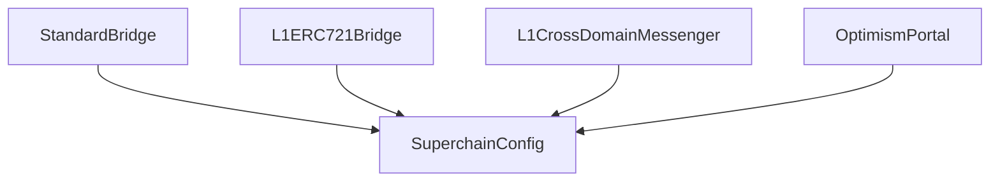

# Superchain Configuration

<!-- START doctoc generated TOC please keep comment here to allow auto update -->
<!-- DON'T EDIT THIS SECTION, INSTEAD RE-RUN doctoc TO UPDATE -->
**Table of Contents**

- [Overview](#overview)
- [Configurable values](#configurable-values)
- [Configuration data flow](#configuration-data-flow)
  - [Pausability](#pausability)
    - [Paused identifiers](#paused-identifiers)
    - [Scope of pausability](#scope-of-pausability)
- [Dependency manager](#dependency-manager)
  - [Interface and properties](#interface-and-properties)
  - [Events](#events)

<!-- END doctoc generated TOC please keep comment here to allow auto update -->

## Overview

The SuperchainConfig contract is used to manage global configuration values for multiple OP Chains within
a single Superchain network.

## Configurable values

Configurability of the Superchain is currently limited to two values:

The `SuperchainConfig` contract manages the following configuration values:

- `PAUSED_SLOT`: A boolean value indicating whether the Superchain is paused.
- `GUARDIAN_SLOT`: The address of the guardian, which can pause and unpause the system.

## Configuration data flow

All contracts which read from the `SuperchainConfig` contract hold its address as storage values
in the proxy account, and call directly to it when reading configuration data.



### Pausability

The Superchain pause feature is a safety mechanism designed to temporarily halt withdrawals from the system in
an emergency situation. The Guardian role is authorized to pause and unpause the system.

#### Paused identifiers

When the system is paused the `Paused(string identifier)` event is emitted. This allows for the
caller to provide additional information to be used during incident response.

#### Scope of pausability

The pause applies specifically to withdrawals of assets from the L1 bridge contracts. The L2 bridge contracts
are not pausable, on the basis that issues on L2 can be addressed more easily by a hard fork in the consensus
layer.

When the Pause is activated, the following methods are disabled:

1. `OptimismPortal.proveWithdrawalTransaction()`
1. `OptimismPortal.finalizeWithdrawalTransaction()`
1. `L1CrossDomainMessenger.relayMessage()`
1. `StandardBridge.finalizeBridgeERC20()`
1. `StandardBridge.finalizeBridgeETH()`
1. `L1ERC721Bridge.finalizeBridgeERC721()`

## Dependency manager

This contract will be updated to manage and keep track of the dependency graph.
It will be queried as the source of truth to get which chains are part of the Superchain.
It will also allow to add a chain to the op-governed cluster and update each chain’s dependency set.

### Interface and properties

The `SuperchainConfig` contract will add the following storage layout and function:

**`SHARED_LOCKBOX`**

- An immutable address pointing to the `SharedLockbox` contract.
- This address MUST be immutable because there's only one `SharedLockbox` for each cluster.

**`systemConfigs`**

- A mapping that associates chain IDs with their respective SystemConfig addresses.
- This will be used when updating dependencies along each chain.

**`dependencySet`**

- An `EnumerableSet` that stores the current list of chain IDs in the dependency set.
- This MUST replicate the same state as the one stored in the `L1BlockInterop` on L2 for each chain.

**`addChain`**

The `addChain` function adds a new chain to the op-governed cluster.

- The function SHOULD only be callable by the authorized `updater` role of the `SuperchainConfig`.
- The function MUST NOT add a chain ID to the dependency set if it is already included.
- The function MUST update all chains dependencies through deposit txs to form a complete mesh graph.
- The function MUST store the provided `SystemConfig` address in the `systemConfigs` mapping.
- The function MUST allowlist the new chain's `OptimismPortal` in the `SharedLockbox`.
- The function MUST emit the `ChainAdded` event with the `chainId` and
  its corresponding `SystemConfig` and `OptimismPortal`.

```solidity
function addChain(uint256 _chainId, address _systemConfig) external;
```

### Events

**`ChainAdded`**

MUST be triggered when `addChain` is called

```solidity
event ChainAdded(uint256 indexed chainId, address indexed systemConfig, address indexed portal);
```
